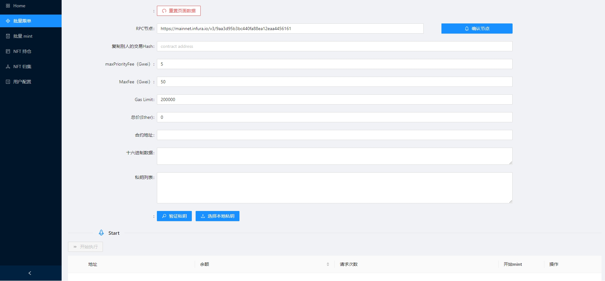
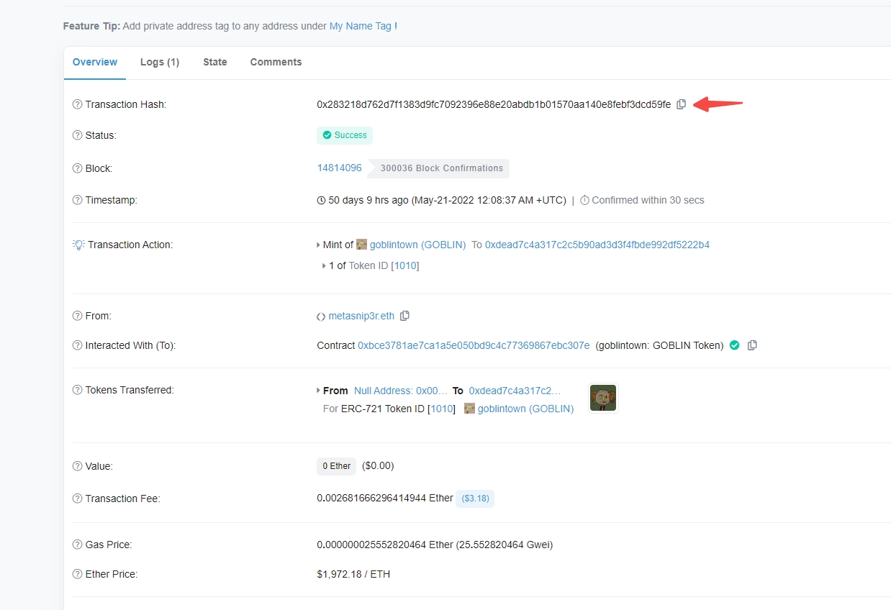

# 批量跟单mint

Step1: 在页面的下方私钥列表输入需要跟单mint的钱包私钥，如需使用多个地址mint,用回车换行隔开，Mint的私钥不会储存在服务器，为了安全，打狗推荐使用小号钱包地址。

Step2: 点下方的验证私钥按钮，确保余额足够支付一次mint的费用。

Step3: 在etherscan找到需要mint的合约页面，复制一个合约下mint成功的tx的hash，粘贴到批量跟单mint页面。

Step4: 复制hash后，页面自动解析hash填好了相关参数，如果需要提高gas可以在页面自行调整需要的gas。配置完成后，点击左下角的开始执行，就完成了批量跟单mint。
