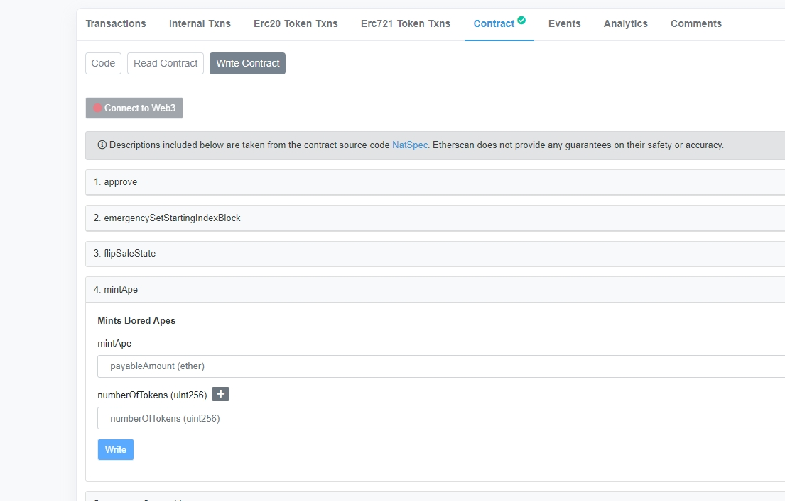

# 批量合约mint

Step1:   
在页面的下方私钥列表输入需要跟单mint的钱包私钥，如需使用多个地址mint,用回车换行隔开，Mint的私钥不会储存在服务器，为了安全，打狗推荐使用小号钱包地址。

Step2:  
点下方的验证私钥按钮，确保余额足够支付mint的费用。

Step3:   
在etherscan的mint的合约页面下，在Write Contract页面找到我们需要用的合约里的mint方法，这里图中以Bored Ape Yacht Club为例。Mint方法为mintApe，单价0.08eth可以mint一个BAYC。

Step4:   
将合约地址，预期支付的gas，总价等参数配置好。Input data选择指定16进制或指定方法。  

手动输入16进制这里不展开教学，可以自行填充也可以复制。  

这里我们选择指定方法，填入合约里的方法mintApe，注意方法需要区分大小写。  

在etherscan的页面上我们发现这个方法需要填写uint256类型的param，对应mint的数量。（总价ether不是param，需要发送的ether数额在页面总价处已经配置好）  

如图配置好指定方法后，点击parse，就填充了16进制数据。

Step5：  
点击开始执行，如果合约已经开启，就以0.08eth的单价mint了一个BAYC。也可以选择定时执行，在指定时间发射tx。执行任务期间不要关闭浏览器。
